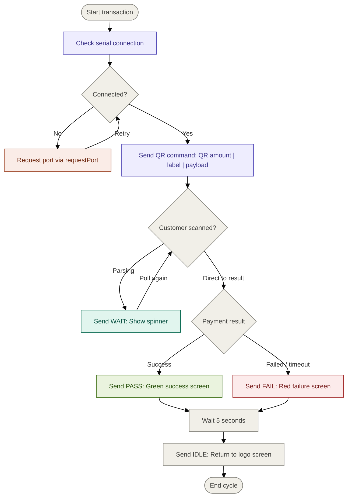

> [!NOTE] This guide is for developers integrating a web application directly with a **Nizi POS B3X display terminal** via the browser's native Web Serial API — no desktop bridge installation required.

---

## Table of Contents

- [[#Flow Diagram]]
- [[#Prerequisites & Browser Support]]
- [[#Serial Connection Settings]]
- [[#Connection Lifecycle]]
    - [[#Connecting]]
    - [[#Auto-Connect (Ping Protocol)]]
    - [[#Disconnecting]]
    - [[#The Single-Tab Limitation]]
- [[#Command Protocol]]
    - [[#Sending Commands]]
    - [[#ACK Reference Table]]
    - [[#Query Commands & Their Responses]]
- [[#Display Commands]]
    - [[#TEXT — Generic Text Screen]]
    - [[#QR — QR Code Payment Screen]]
    - [[#PASS — Success Screen]]
    - [[#FAIL — Failure Screen]]
    - [[#INFO — Information Screen]]
    - [[#WARN — Warning Screen]]
    - [[#WAIT — Loading Screen]]
    - [[#IDLE — Idle / Logo Screen]]
    - [[#RESET — Reset Device]]
    - [[#SCREENTIME — Screen Sleep Timer]]
    - [[#WAKE — Wake from Sleep]]
- [[#Binary Image Upload]]
    - [[#Protocol A — Real-Time Image (RAM)]]
    - [[#Protocol B — Wallpaper Upload (Flash)]]
- [[#Error Handling Patterns]]


---

## Flow Diagram
---




---
## Prerequisites & Browser Support

Web Serial is a browser-native API and works only under the following conditions:

|Requirement|Detail|
|:--|:--|
|**Browser**|Chromium-based only — Chrome, Edge, Opera|
|**Context**|Must be `https://` or `localhost` (secure context)|
|**User Gesture**|Port selection requires a user interaction (button click)|
|**Permission**|Browser remembers granted ports — usable for auto-connect on future visits|

> [!WARNING] Firefox / Safari Web Serial is **not supported** in Firefox or Safari. Always gate your integration behind a `"serial" in navigator` check and surface a clear browser requirement message if it fails.

```js
if (!("serial" in navigator)) {
  alert("Please use Chrome or Edge to use this feature.");
}
```

## Serial Connection Settings

The Nizi POS B3X uses a **CH340 USB-to-UART** chipset. Use these exact values when opening a port:

|Parameter|Value|
|:--|:--|
|Baud Rate|`115200`|
|Data Bits|`8`|
|Stop Bits|`1`|
|Parity|`none`|
|Flow Control|`none`|
|USB Vendor ID|`0x1A86` (WCH / Jiangsu Qinheng)|
|USB Product IDs|`0x7523`, `0x5523`, `0x5512`, `0x7522`|

> [!TIP] You only need the Vendor ID when filtering via `requestPort()`. The Product IDs are useful for stricter filtering if your environment has multiple CH340 devices.

---

## Connection Lifecycle

### Connecting

The first time a user connects, they must approve the port through the browser's native picker. Filter by CH340's Vendor ID to narrow the list:

```js
const port = await navigator.serial.requestPort({
  filters: [{ usbVendorId: 0x1A86 }]
});

await port.open({ baudRate: 115200 });
```

After opening, set up a `writer` for sending commands and start a background read loop to receive device responses asynchronously.

```js
const writer = port.writable.getWriter();

// Start async read loop (see read loop pattern below)
startReadLoop(port);
```

---

### Auto-Connect (Ping Protocol)

After a user has approved a port at least once, the browser remembers it. On subsequent page loads, you can silently reconnect without prompting:

```js
const ports = await navigator.serial.getPorts();

for (const port of ports) {
  // Filter by CH340 vendor ID
  const info = port.getInfo();
  if (info.usbVendorId !== 0x1A86) continue;

  // Probe: send DEVICE_ID, wait for matching response
  const isNizi = await probePort(port);
  if (isNizi) {
    // Confirmed — open and use this port
    await port.open({ baudRate: 115200 });
    break;
  }
}
```

**Probe logic** — open the port temporarily, send `DEVICE_ID\n`, and verify the response matches the device pattern:

```js
async function probePort(port) {
  try {
    await port.open({ baudRate: 115200 });
    const writer = port.writable.getWriter();
    const reader = port.readable.getReader();

    await writer.write(new TextEncoder().encode("DEVICE_ID\n"));
    writer.releaseLock();

    let response = "";
    const deadline = Date.now() + 1000; // 1 second timeout

    while (Date.now() < deadline) {
      const { value, done } = await reader.read();
      if (done) break;
      response += new TextDecoder().decode(value, { stream: true });
      if (response.includes("\n")) break;
    }

    await reader.cancel();
    await port.close();

    // Valid Nizi POS B3X devices respond with NIZI_POS_B3x or NIZIPOS_B3x
    return /NIZI_?POS_B3\d/i.test(response.trim());
  } catch {
    try { await port.close(); } catch {}
    return false;
  }
}
```

---

### Disconnecting

Always release locks in order before closing the port. Skipping any step may leave the port in a locked state, requiring a browser restart to recover:

```js
async function disconnect(port, reader, writer) {
  // 1. Stop your read loop flag first
  isReading = false;

  // 2. Cancel the reader (unblocks the read loop)
  if (reader) {
    try { await reader.cancel(); } catch {}
  }

  // 3. Release the writer lock
  if (writer) {
    try { writer.releaseLock(); } catch {}
  }

  // 4. Close the port
  if (port) {
    try { await port.close(); } catch {}
  }
}
```

> [!CAUTION] Always cancel the reader before closing Calling `port.close()` while a reader lock is still held will throw an error and leave the port in an unusable state for the rest of the browser session.

---

### The Single-Tab Limitation

> [!IMPORTANT] One Port, One Tab **A serial port can only be held open by one browser tab at a time.** This is an OS-level constraint enforced by the browser.

**What this means for your app:**

- If a user opens your app in two tabs and connects on Tab A, Tab B will fail silently or throw when attempting to open the same port.
- If a user navigates away without disconnecting, the port stays locked to that tab until it is closed.
- Hard refreshing a tab releases the port, but navigating away (without disconnect) may not.

**Recommended mitigation strategies:**

1. **Explicit disconnect on `beforeunload`:** Release the port when the user navigates away.

```js
window.addEventListener("beforeunload", () => {
  // Best-effort; browsers may not await async here
  if (port) port.close().catch(() => {});
});
```

2. **Graceful error on open failure:** Catch `DOMException: Failed to open serial port` and tell the user which action to take.

```js
try {
  await port.open({ baudRate: 115200 });
} catch (err) {
  if (err.name === "InvalidStateError") {
    alert("Port is in use by another tab. Close that tab and try again.");
  }
}
```

3. **Connection status in `sessionStorage`:** Track open state per tab so your UI stays consistent.

---

## Command Protocol

### Sending Commands

All commands are plain text strings terminated with a newline (`\n`). Arguments are separated by `**` (double asterisk):

```
COMMAND_NAME**arg1**arg2\n
```

After sending, the device replies with an **ACK string** (also newline-terminated). You should always wait for and verify the ACK before sending the next command.

**Basic send + await ACK pattern:**

```js
async function sendCommand(writer, readNextLine, commandStr) {
  const encoded = new TextEncoder().encode(commandStr + "\n");
  await writer.write(encoded);

  const response = await readNextLine(3000); // wait up to 3s
  return response.trim();
}
```

**Reading lines from the device** — the device sends newline-terminated responses. Use a streaming read loop that buffers partial data:

```js
async function startReadLoop(port, onLine) {
  const textDecoder = new TextDecoderStream();
  port.readable.pipeTo(textDecoder.writable);
  const reader = textDecoder.readable.getReader();
  let partial = "";

  while (true) {
    const { value, done } = await reader.read();
    if (done) break;

    partial += value;
    const lines = partial.split("\n");
    partial = lines.pop(); // keep the incomplete fragment

    for (const line of lines) {
      if (line.trim()) onLine(line.trim());
    }
  }
}
```

---

### ACK Reference Table

> [!NOTE] Legacy vs B3X The table below covers the **B3X series (B30–B33)**. The legacy 0620 series uses different command names for some operations — consult the original device spec if targeting older hardware.

|Category|Command|Expected ACK|
|:--|:--|:--|
|**Identity**|`DEVICE_ID`|_(returns device model string)_|
||`FIRMWARE_ID`|_(returns firmware version string)_|
|**Reboot**|`RESET`|`RESET_OK`|
|**Screen**|`IDLE`|`IDLE_OK`|
||`WAKE`|`WAKE_OK`|
|**Idle Modes**|`IDLE_SINGLE**[IMG]`|`MODE_SINGLE_OK`|
||`IDLE_CYCLE**[Img1]**[T1]**[Img2]**[T2]`|`MODE_CYCLE_OK`|
||`IDLE_SLEEP**[IMG]**[MS]`|`MODE_SLEEP_OK` _(min 30000 ms)_|
||`IDLE_SLEEP_WAKE**[Img]**[SleepMS]**[WakeMS]`|`MODE_SLEEP_WAKE_OK`|
||`GET_IDLE`|_(returns idle config string)_|
|**Transaction UI**|`WAIT**[Amt]**[Msg]`|`WAIT_OK`|
||`QR**[Amt]**[Label]**[Data]`|`QR_OK`|
||`PASS**[Title]**[Body]`|`PASS_OK`|
||`FAIL**[Title]**[Body]`|`FAIL_OK`|
||`INFO**[Title]**[Body]`|`INFO_OK`|
||`WARN**[Title]**[Body]`|`WARN_OK`|
||`TEXT**[Title]**[Sub]**[Body]`|`TEXT_OK`|
|**System**|`VOLUME**[0-100]`|`VOLUME_OK`|
||`GET_VOLUME`|`VOLUME**[value]`|
||`BRIGHTNESS**[0-100]`|`BRIGHTNESS_OK`|
||`GET_BRIGHTNESS`|`BRIGHTNESS**[value]`|
||`TIMEOUT**[QR_MS]**[PF_MS]`|`TIMEOUT_OK`|
||`BLE_ON`|`BLE_ON_OK`|
||`BLE_OFF`|`BLE_OFF_OK`|
||`GET_BLE`|`BLE_ON` or `BLE_OFF`|
|**Image Upload**|`IMAGE_UPLOAD:[size]`|`READY`|
||`IMAGE_UPLOAD_2:[size]`|`READY`|

---

### Query Commands & Their Responses

Query commands return structured strings rather than simple `_OK` ACKs:

|Command|Example Response|
|:--|:--|
|`DEVICE_ID`|`NIZI_POS_B31`|
|`FIRMWARE_ID`|`v2.0.0`|
|`GET_IDLE`|`MODE:SINGLE,image_name=IMG1` or `MODE:CYCLE,img1=IMG1,time1=60000,img2=IMG2,time2=60000`|
|`GET_VOLUME`|`VOLUME**80`|
|`GET_BRIGHTNESS`|`BRIGHTNESS**50`|
|`GET_BLE`|`BLE_ON` or `BLE_OFF`|

Parse response values like this:

```js
const res = await sendCommand(writer, readNextLine, "GET_VOLUME");
// res = "VOLUME**80"
const volume = parseInt(res.split("**")[1], 10); // → 80
```

---

## Display Commands

> [!NOTE] Character limits by glyph width Limits vary by character width. The device classifies characters as narrow (`l`), medium (`H`), or wide (`W`) — reflecting how much horizontal space each takes on screen. When in doubt, target the `H` limits as a safe middle ground for mixed text.

---

### TEXT — Generic Text Screen

Displays a freeform screen with a title, subtitle, and multi-line body message. Suitable for custom notifications, receipts, or informational screens.

```
TEXT**{Main Title}**{Subtitle}**{Multi Line Message}
```

**Field limits:**

|Field|Max chars (`l`)|Max chars (`H`)|Max chars (`W`)|Max lines|
|:--|:-:|:-:|:-:|:-:|
|`{Main Title}`|60|24|18|2|
|`{Subtitle}`|44|15|12|1|
|`{Multi Line Message}`|399|180|140|8 (`l`) / 10 (`H`, `W`)|

> [!CAUTION] 399-character hard limit on message body If `{Multi Line Message}` exceeds **399 characters**, the device will **restart automatically**. Always validate length before sending.

Use `<br>` tags in `{Multi Line Message}` for explicit line breaks.

```js
// Example
await sendCommand("TEXT**Payment Info**Transaction ID: #4821**Amount: Rs. 560.50<br>Status: Pending<br>Please wait...");
```

---

### QR — QR Code Payment Screen

Renders a QR code from a token/URL alongside an amount and action label.

```
QR**{Amount with Currency}**{Action Text}**{Dynamic QR Token}
```

**Field limits:**

|Field|Max chars (`l`)|Max chars (`H`)|Max chars (`W`)|Max lines|
|:--|:-:|:-:|:-:|:-:|
|`{Amount with Currency}`|14 digits|14 digits|14 digits|1|
|`{Action Text}`|31|12|9|1|
|`{Dynamic QR Token}`|1003|1003|1003|—|

> [!NOTE] QR code size scales with token length Tokens up to 1003 characters render at **37.5 mm**. Tokens longer than 1003 characters render at **30 mm** (smaller QR, more data density).

> [!TIP] Amount prefix The `{Amount with Currency}` field should include the currency prefix in the string itself, e.g. `Rs. 560.50`. The 14-digit limit applies to the numeric digits only.

```js
// Example
await sendCommand("QR**Rs. 1234.00**Scan to Pay**upi://pay?pa=merchant@upi&pn=Store&am=1234.00&cu=INR");
```

---

### PASS — Success Screen

Shows a green success screen with a checkmark, amount, and message. Plays an audio prompt on the device.

```
PASS**{Amount with Currency}**{Message}
```

**Field limits:**

|Field|Max chars (`l`)|Max chars (`H`)|Max chars (`W`)|Max lines|
|:--|:-:|:-:|:-:|:-:|
|`{Amount with Currency}`|23 digits|23 digits|23 digits|2|
|`{Message}`|385|126|98|7|

```js
// Example
await sendCommand("PASS**Rs. 560.50**Payment successful");
```

---

### FAIL — Failure Screen

Shows a red failure screen with an X icon, amount, and message. Plays an audio prompt on the device.

```
FAIL**{Amount with Currency}**{Message}
```

**Field limits:**

|Field|Max chars (`l`)|Max chars (`H`)|Max chars (`W`)|Max lines|
|:--|:-:|:-:|:-:|:-:|
|`{Amount with Currency}`|23 digits|23 digits|23 digits|2|
|`{Message}`|385|126|98|7|

> [!NOTE] Unlike `PASS`, the amount field here does **not** include a `Rs.` prefix in the character limit — the 23-digit limit is for the raw numeric/string value you pass.

```js
// Example
await sendCommand("FAIL**Rs. 560.50**Payment Failed");
```

---

### INFO — Information Screen

Shows a blue information screen with an ℹ️ icon. Useful for non-critical notices.

```
INFO**{Title}**{Message}
```

**Field limits:**

|Field|Max chars (`l`)|Max chars (`H`)|Max chars (`W`)|Max lines|
|:--|:-:|:-:|:-:|:-:|
|`{Title}`|96|34|26|2|
|`{Message}`|385|126|98|7|

```js
// Example
await sendCommand("INFO**Important**Keep Device Connected");
```

---

### WARN — Warning Screen

Shows an orange warning screen with a ⚠️ icon.

```
WARN**{Title}**{Message}
```

**Field limits:**

|Field|Max chars (`l`)|Max chars (`H`)|Max chars (`W`)|Max lines|
|:--|:-:|:-:|:-:|:-:|
|`{Title}`|96|34|26|2|
|`{Message}`|385|126|98|7|

```js
// Example
await sendCommand("WARN**Device Not Ready**Please wait");
```

---

### WAIT — Loading Screen

Shows a spinner/loading screen with an amount and status message. Use this while a payment is being processed.

```
WAIT**{Amount with Currency}**{Message}
```

**Field limits:**

|Field|Max chars (`l`)|Max chars (`H`)|Max chars (`W`)|Max lines|
|:--|:-:|:-:|:-:|:-:|
|`{Amount with Currency}`|23 digits|23 digits|23 digits|2|
|`{Message}`|385|126|98|7|

```js
// Example
await sendCommand("WAIT**Rs. 560.50**Please wait");
```

---

### IDLE — Idle / Logo Screen

Returns the display to the default idle/logo screen. Takes no arguments.

```
IDLE
```

```js
await sendCommand("IDLE");
```

---

### RESET — Reset Device

Performs a soft reset / restart of the device. The device will be unresponsive for a few seconds after this command.

```
RESET
```

```js
await sendCommand("RESET");
// Wait a few seconds before sending further commands
await sleep(3000);
```

---

### SCREENTIME — Screen Sleep Timer

Sets the inactivity timeout before the screen enters sleep mode. Any valid command sent after sleep will wake the device immediately.

```
SCREENTIME**{time_in_seconds}
```

- Minimum: `30` seconds
- Maximum: `300` seconds (5 minutes)

```js
// Example: sleep after 2 minutes of inactivity
await sendCommand("SCREENTIME**120");
```

---

### WAKE — Wake from Sleep

Manually wakes the screen from sleep mode without changing the current display state.

```
WAKE
```

```js
await sendCommand("WAKE");
```

---

## Binary Image Upload

The device supports two distinct protocols for images. Choose based on your use case:

||Protocol A — Real-Time|Protocol B — Wallpaper|
|:--|:--|:--|
|**Stored in**|RAM (volatile)|Flash (non-volatile)|
|**Persists on reboot**|❌ No|✅ Yes|
|**Slots available**|N/A (display buffer)|`IMG1.jpg`, `IMG2.jpg`|
|**Use for**|Banners, receipts, dynamic content|Background / idle images|
|**Image size limit**|~30 KB|~30 KB|
|**Image type**|JPEG baseline only (no progressive JPEG)||
|**Resolution (B30/B31)**|`240×320`|`240×320`|
|**Resolution (B32/B33)**|`320×480`|`320×480`|

> [!IMPORTANT] Prepare your image first Always resize and compress your JPEG to the correct resolution and **under 30 KB** before initiating either protocol. Oversized images will fail or corrupt the display buffer.

---

### Protocol A — Real-Time Image (RAM)

Sends a JPEG to the device's RAM buffer for immediate display. Does not survive a reboot.

**Sequence:**

```
1. Send text command:   START_RTIMAGE\n
2. Wait 150ms
3. Send 8-byte binary header: [magic 4 bytes] + [size 4 bytes LE]
4. Wait 100ms
5. Read 1 byte: must be 'R' (0x52) → device is ready
6. Stream JPEG data in 1024-byte chunks
7. Read 1 byte: 'K' (0x4B) = success, 'E' (0x45) = error
```

**Magic header bytes (little-endian):** `[0x33, 0xCC, 0x55, 0xAA]`

```js
async function uploadRealtimeImage(jpegBytes, writer, readNextLine) {
  // Step 1: announce upload
  await sendCommand(writer, readNextLine, "START_RTIMAGE");
  await sleep(150);

  // Step 2: 8-byte header = magic + file length (uint32 LE)
  const header = new Uint8Array(8);
  header.set([0x33, 0xCC, 0x55, 0xAA], 0);
  new DataView(header.buffer).setUint32(4, jpegBytes.length, true);
  await writer.write(header);
  await sleep(100);

  // Step 3: wait for 'R' (ready signal)
  const ready = await readNextLine(2000);
  if (!ready.includes("R")) throw new Error("Device not ready");

  // Step 4: stream JPEG in 1 KB chunks
  for (let i = 0; i < jpegBytes.length; i += 1024) {
    await writer.write(jpegBytes.subarray(i, i + 1024));
  }

  // Step 5: await ACK
  const ack = await readNextLine(5000);
  if (!ack.includes("K")) throw new Error(`Upload failed: ${ack}`);
}
```

---

### Protocol B — Wallpaper Upload (Flash)

Uploads a JPEG to flash memory as a persistent background image (`IMG1.jpg` or `IMG2.jpg`). Data is transferred in 512-byte chunks, each protected by a CRC32 checksum.

**Sequence:**

```
1. Send: IMAGE_UPLOAD:{totalBytes}\n   (or IMAGE_UPLOAD_2 for slot 2)
2. Wait for device line containing "READY"
3. For each 512-byte chunk:
   a. Send: CHUNK:{offset},{length},{CRC32_HEX}\n
   b. Wait for line containing "CHUNK_START"
   c. Write raw binary chunk bytes
   d. Wait for line containing "CHUNK_OK"  (or "CHUNK_FAIL" → retry/abort)
4. Wait for line containing "UPLOAD_DONE"
```

The CRC32 used is **IEEE 802.3** (polynomial `0xEDB88320`), standard in Ethernet and ZIP.

```js
async function uploadWallpaper(jpegBytes, slot = 1, writer, readNextLine, onProgress) {
  const size = jpegBytes.length;
  const cmd = slot === 2 ? `IMAGE_UPLOAD_2:${size}` : `IMAGE_UPLOAD:${size}`;

  const readyResp = await sendCommand(writer, readNextLine, cmd, 5000);
  if (!readyResp.includes("READY")) throw new Error("Device not ready");

  const CHUNK = 512;
  let offset = 0;

  while (offset < size) {
    const chunk = jpegBytes.subarray(offset, Math.min(offset + CHUNK, size));
    const crc = crc32(chunk).toString(16).toUpperCase().padStart(8, "0");

    await sendCommand(writer, readNextLine, `CHUNK:${offset},${chunk.length},${crc}`);

    const start = await readNextLine(3000);
    if (!start.includes("CHUNK_START")) throw new Error(`No CHUNK_START at ${offset}`);

    await writer.write(chunk);

    const ack = await readNextLine(3000);
    if (!ack.includes("CHUNK_OK")) throw new Error(`Chunk failed at ${offset}: ${ack}`);

    offset += chunk.length;
    onProgress?.(Math.round((offset / size) * 100));
  }

  const done = await readNextLine(5000);
  if (!done.includes("UPLOAD_DONE")) throw new Error("Upload did not confirm DONE");
}
```

> [!TIP] CRC32 implementation You can use any standard IEEE 802.3 CRC32 library (e.g., `crc32` on npm) or implement it with the `0xEDB88320` reflected polynomial. The checksum must be formatted as an **8-character uppercase hex string** (e.g., `A1B2C3D4`).

---

## Error Handling Patterns

### Timeout waiting for ACK

Wrap every `readNextLine` call with a timeout. If the device is busy, rebooting, or in an error state, it may not respond at all:

```js
function readNextLine(timeoutMs = 3000) {
  return new Promise((resolve, reject) => {
    const timer = setTimeout(() => reject(new Error("Device timeout")), timeoutMs);
    lineWaiters.push((line) => {
      clearTimeout(timer);
      resolve(line);
    });
  });
}
```

### Unexpected ACK response

If the device returns a different ACK than expected (e.g., a leftover message from a previous command), treat it as an error and do not proceed:

```js
const ack = await readNextLine(3000);
if (ack !== "QR_OK") {
  throw new Error(`Expected QR_OK, got: ${ack}`);
}
```

> [!WARNING] Stale line queue Always **clear any buffered lines** before sending a new command. If your read loop queued up leftover responses from a prior command, the next `readNextLine` will return the stale data instead of the fresh ACK.
> 
> ```js
> lineQueue = []; // clear before sendCommand
> ```

### Port locked by another tab

```js
try {
  await port.open({ baudRate: 115200 });
} catch (err) {
  if (err.message.includes("Failed to open serial port")) {
    // Port is already open in another tab or process
    showError("Device is in use. Close other tabs using this device and try again.");
  }
}
```

### Chunk upload failure

On `CHUNK_FAIL`, you can retry the same chunk before aborting:

```js
let retries = 0;
while (retries < 3) {
  await sendCommand(writer, readNextLine, `CHUNK:${offset},${chunk.length},${crc}`);
  await readNextLine(3000); // wait CHUNK_START
  await writer.write(chunk);
  const ack = await readNextLine(3000);
  if (ack.includes("CHUNK_OK")) break;
  retries++;
  if (retries === 3) throw new Error(`Chunk at ${offset} failed after 3 retries`);
}
```
